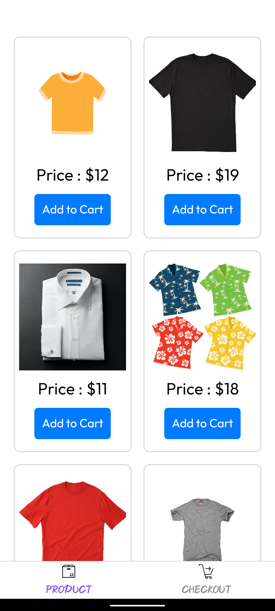
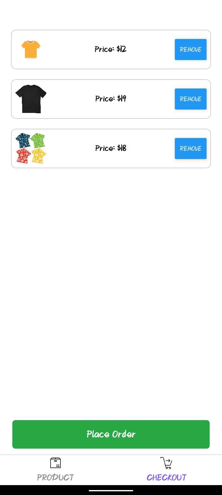
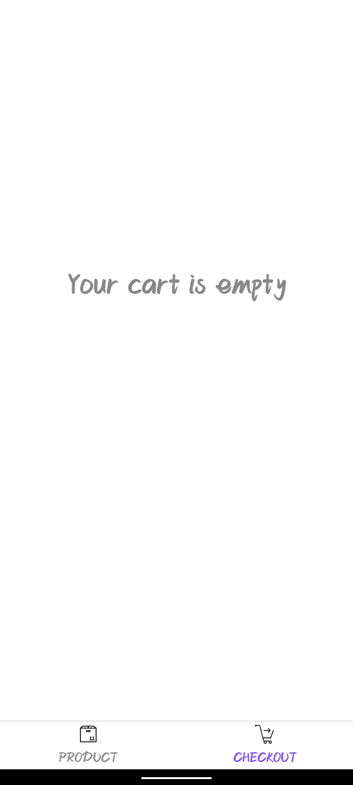

# Simple Shopping App

This is a simple shopping app built using React Native and Expo. The app features a list of products that users can add to their cart and proceed to checkout. The app has a bottom navigation bar for easy navigation between the products and checkout screens.

## Features

- List of products
- Add/remove products to/from the cart
- Checkout screen with the list of selected products
- Order successful screen after placing an order
- Bottom navigation bar for easy navigation

## Screenshots

### Product Screen
This screen shows the list of products available in the shop.

### Checkout Screen
This screen displays the items added to the cart for checkout.

### Empty Cart Screen
This screen displays if there is no item in the cart.

### Order Successful Screen
This screen is displayed after successfully placing an order.

## APK Download

You can download the APK from the following link:

[Download APK](https://expo.dev/artifacts/eas/wSJdX6pjpksvv4X5c1FtUt.apk)